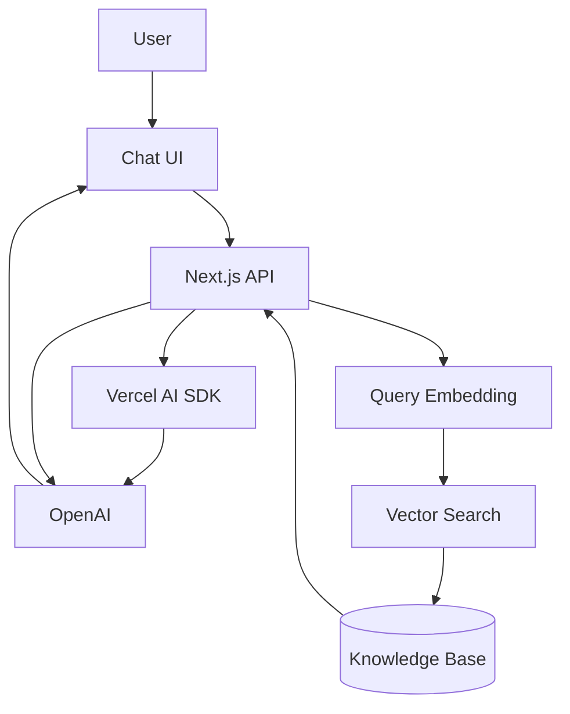

# AI Knowledge Assistant 🤖

AI-powered knowledge assistant that lets users interact with a private knowledge base using natural language. The application retrieves relevant information from indexed documents and uses an LLM to generate grounded responses.

## Tech Stack

- **Next.js**
- **React**
- **TypeScript**
- **Vercel AI SDK**
- **OpenAI**
- **AI Elements**
- **Tailwind CSS**
- **PostgreSQL / NeonDB**
- **Drizzle ORM**

## Key Features

- Streaming AI responses in real time
- Conversational chat interface
- Document ingestion and processing
- Embedding-based semantic search
- RAG-powered responses grounded in the knowledge base
- Structured AI outputs
- Tool calling and multi-step AI workflows
- Loading, error, and generation states
- Ability to stop an active generation
- Responsive chat interface

## Architecture

## Core Flow

1. User sends a question through the chat interface.
2. The backend generates an embedding for the query.
3. Relevant knowledge is retrieved using semantic search.
4. Retrieved context is provided to the LLM.
5. The model generates a grounded response.
6. The response is streamed to the user in real time.

## Project Goals

- Build a production-style AI application with modern AI SDK patterns.
- Combine LLMs, streaming, embeddings, RAG, and tool calling in one application.
- Keep the architecture modular so additional AI capabilities can be added without redesigning the application.
